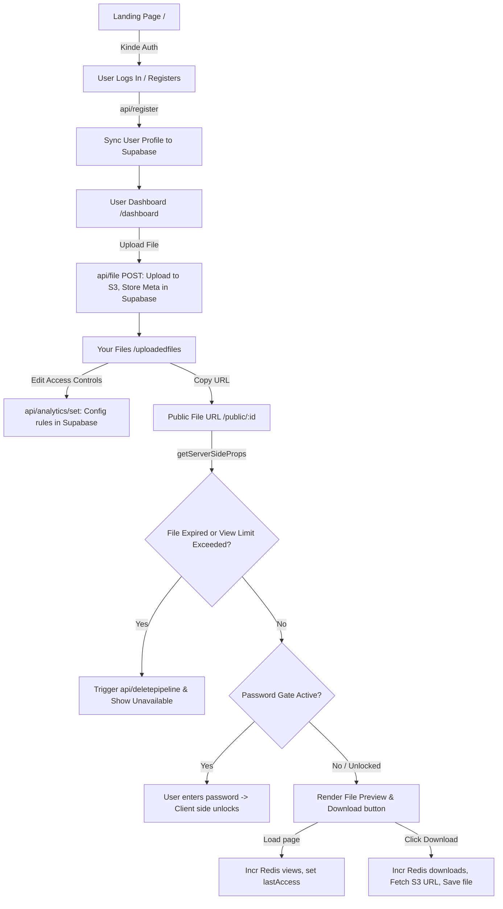

# 📂 Track Vault: Complete Revision & Interview Preparation Guide

Welcome to the master revision guide for **Track Vault**. This document has been prepared to serve as a comprehensive self-study and revision resource for web development interviews. It covers the project's architecture, flow, files, tech stack, database schema, design decisions, bad practices, security vulnerabilities, and answers to potential interview questions.

---

## 1. Project Overview

### What Problem Track Vault Solves
Standard file-sharing solutions (like Google Drive, Dropbox, or WeTransfer) suffer from **poor post-sharing control**. Once a user shares a link:
1. They cannot easily limit how many times the file is downloaded or viewed.
2. They cannot guarantee the file will self-destruct from the cloud after access or expiration.
3. They cannot view real-time statistics of accesses (views, downloads, last-accessed timestamps) without heavy analytics platforms.

**Track Vault** provides an easy-to-use, secure, self-hosted file vault that allows users to upload files, configure strict access controls (passwords, view limits, download limits, expiry times), and track live usage statistics. 

### Core Objective
To enable **secure, private, and self-destructing file sharing** with granular controls and high-throughput real-time tracking, combining AWS S3 (durable storage), Supabase (relational metadata), and Upstash Redis (high-performance atomic transient analytics).

### Main Features
- **Secure File Upload**: Files are renamed with UUIDs and uploaded securely to an AWS S3 bucket.
- **Granular Access Control Rules**:
  - Expiry date and time.
  - Maximum views and maximum downloads limit.
  - Optional password locking.
  - **Self-Destruct Toggles**: Option to delete the physical S3 object automatically when the file expires (`delete_on_expire`) or when limits are reached (`delete_on_limit`).
- **Real-Time Analytics**: Tracks total views, total downloads, and the exact timestamp of the last access using Redis.
- **Active vs. Inactive Split**: Active files are available for download; expired/deleted files are automatically filtered into an "Inactive Files" tab displaying historical analytics.

### User Flow (Start-to-End)


---

## 2. Folder Structure Explanation

Here is the structural map of the Track Vault codebase and the role of each directory/file:

```
track-vault/
├── src/
│   ├── app/                    # Next.js App Router (Client & Server Components)
│   │   ├── about/              # Static informational page about Track Vault
│   │   ├── api/                # Next.js Route Handlers (Backend API endpoints)
│   │   │   ├── analytics/
│   │   │   │   ├── get/        # GET: Fetches live stats from Redis (views, downloads, lastAccess)
│   │   │   │   ├── set/        # POST: Updates file access settings in Supabase
│   │   │   │   └── track/      # POST: Increments view/download counter in Redis
│   │   │   ├── auth/           # Kinde OAuth route wildcard dynamic router
│   │   │   ├── deletepipeline/ # DELETE: Handles physical S3 deletion and DB status updates
│   │   │   ├── file/           # POST (upload to S3 & DB insert), DELETE (remove file)
│   │   │   └── register/       # POST: Syncs authenticated Kinde user with DB 'users' table
│   │   ├── dashboard/          # Secure upload workspace
│   │   ├── uploadedfiles/      # User's file vault manager (Active vs. Inactive)
│   │   │   └── [id]/           # File-specific live analytics and management panel
│   │   ├── layout.jsx          # Root layout defining Providers, Toaster, Navbar, and Footer
│   │   └── page.jsx            # Landing page (Welcome screen, Features, Login links)
│   ├── pages/                  # Next.js Pages Router (Dynamic SSR for public sharing)
│   │   └── public/
│   │       └── [id].jsx        # Public file download page with password checking and limits
│   ├── components/             # Reusable UI & Layout Components
│   │   ├── analyticsContol/    # Components for File analytics rendering & access rules settings
│   │   │   ├── Analytics.jsx   # Polls /api/analytics/get and displays live graphs/stats
│   │   │   ├── Editanalytics.jsx # Form containing inputs for password, expiry, and limits
│   │   │   └── Preview.jsx     # Handles conditional renders for PDFs, Images, and Text files
│   │   ├── filecard/           # File representation modules
│   │   │   ├── Filecard.jsx    # Card structure for active files with quick action links
│   │   │   ├── InactiveFileCard.jsx # Card for inactive files (shows historic Redis stats)
│   │   │   └── Options.jsx     # Copy, Download, and Delete buttons
│   │   ├── ui/                 # Shadcn UI base components (Separators, Buttons, Cards)
│   │   ├── Footer.jsx          # Footer containing Github repo links
│   │   ├── Navbar.jsx          # Navigation panel displaying Kinde Auth toggle states
│   │   └── Provider.jsx        # Kinde Auth context wrapper
│   ├── lib/                    # Initialization files for client connections
│   │   ├── axios.js            # Axios client with base URL configuration
│   │   ├── redis.js            # Upstash Redis client configuration
│   │   ├── s3.js               # AWS S3 Client setup using AWS SDK v3
│   │   ├── supabase.js         # Supabase JS client config
│   │   └── utils.js            # Tailwind merge utility helper
│   └── styles/
│       └── globals.css         # Tailwind directives and CSS definitions
├── package.json                # Project dependencies and startup scripts
└── README.md                   # Repository documentation
```

### Key File Relationships & Connections:
* **The Auth Provider Loop**: `src/components/Provider.jsx` wraps the application in `layout.jsx`. The `Navbar.jsx` reads server session info via `getKindeServerSession()`, while client-side routes (like `dashboard/page.jsx`) read user data via the client hook `useKindeAuth()`.
* **API Client**: Frontend client components (e.g., `Editanalytics.jsx`, `Options.jsx`) use `src/lib/axios.js` as their HTTP client to perform API calls targeting endpoints inside `src/app/api/`.
* **Database & Caching Bridge**: When a public user accesses a shared file on `src/pages/public/[id].jsx`, `getServerSideProps` fetches persistent metadata from Supabase (`src/lib/supabase.js`) and logs/increments live tracking numbers in Upstash Redis (`src/lib/redis.js`).

---

## 3. Full Code Flow

### 1. Backend Request Lifecycle (Upload Event)
1. **Frontend Call**: Client makes a POST request to `/api/file` passing a `FormData` object containing the file binary, the original filename, and the `user_id`.
2. **Body Parsing**: Next.js route handler receives request, parses the multipart form data using `await req.formData()`.
3. **File Buffering**: The file binary is extracted, converted into an `ArrayBuffer`, and then into a Node.js `Buffer` in memory.
4. **S3 Upload**: A `PutObjectCommand` is issued to `s3Client` to write the buffer into the bucket. The target key is randomized using `uuidv4()`.
5. **Supabase Record**: A row is inserted into the `files` table containing S3 url, file size, mime-type, user owner reference, and UUID key.
6. **Response**: JSON status 200 returned with the database row structure.

### 2. Frontend Rendering Lifecycle (Analytics Dashboard)
1. **Initial SSR**: User visits `/uploadedfiles/[id]`. Next.js processes `FileAnalyticsPage` on the server.
2. **Server-Side Checks**: Authenticates user using Kinde. Fetches file details from Supabase. Queries Upstash Redis for views, downloads, and last accessed timestamp in parallel using `Promise.all()`.
3. **HTML Generation**: Hydrates components and sends pre-rendered HTML to the client browser.
4. **Client Hydration & Polling**: The page mounts. The `Analytics` component initializes a `useEffect` loop that fires a GET request to `/api/analytics/get?id=fileId` every 5 seconds.
5. **Re-rendering**: Live numbers on screen dynamically update without page reloads.

### 3. API Calling Flow
```
[Client Components] -> [Axios Base Config] -> [Next.js Route Handler] -> [Cloud Service S3/DB]
```
Axios is configured globally with a fallback URL of `http://localhost:3000/api` and `withCredentials: true`. This ensures cookie sessions (like Kinde tokens) propagate safely to API endpoints.

### 4. Database Interaction Flow
- Supabase acts as the persistent system of record.
- **Reads**: Performed during page loads on `/uploadedfiles` (displays cards) and `/public/[id]` (validates parameters).
- **Writes**: Performed when creating files (`insert`) or editing access rules (`update` in `src/app/api/analytics/set/route.js`).
- **Synchronizations**: The `/api/register` route runs an `upsert` query on conflict with user email, making sure user registration is idempotent.

### 5. Authentication Flow
```
[User Click Login] ──> [Redirect to Kinde OAuth Page]
                             │
                             ▼
[Redirect back to App] ──> [Next.js Auth Route Handler]
                             │
                             ▼
[Sync Session Cookie]  ──> [/dashboard reads useKindeAuth()]
                             │
                             ▼
[Register useEffect]  ──> [POST /api/register to insert DB User]
```

---

## 4. File-by-File Deep Breakdown

### 📂 `src/pages/public/[id].jsx` (Dynamic Shared Access Page)
* **Purpose**: Serves files to public users, enforces security gates (passwords, limits, expiry), and collects downloads and views analytics.
* **Logic Explanation**: 
  - `getServerSideProps`: Executes strictly on the server for each page request.
    1. Fetches metadata of the file by ID.
    2. Validates if the file is expired (current timestamp vs `expires_at`).
    3. If expired, and `delete_on_expire` is checked, sends a DELETE request to `/api/deletepipeline` to clean up AWS S3 and mark it inactive.
    4. If active, increments the view counter in Redis (`file:id:views`) and records current timestamp under `file:id:lastAccess`.
    5. Validates if `max_views` limit is breached. If so, triggers `/api/deletepipeline` and returns an expired state prop.
    6. Returns `fileMeta` prop to the frontend component.
  - **React component**:
    - Checks if `file.expired` is true; renders a warning card.
    - If `file.file_password` exists, displays a password text box. When submitted, checks if input matches `file.file_password` on the client.
    - If correct, renders file preview (MIME type matching for images, pdf preview inside an `iframe`, or a download button).
    - When download is clicked, triggers `handleDownload`: calls `/api/analytics/track` to increment download counter, fetches the raw S3 URL, converts it to a blob, and programmatically triggers browser download.
* **Inputs & Outputs**:
  - Input: Route parameters (containing file ID).
  - Output: HTML page rendering the unlocked file or password gate.
* **Dependencies**: `supabase`, `redis`, `api` (axios instance), `FlickeringGrid`, UI components.
* **Edge Cases Handled**: File not found, file expired, view limits reached, PDF preview iframe rendering, download limits tracking.
* **Critiques**:
  - **Severe Security Bug**: Client-side password validation! `fileMeta` containing `file.file_password` is sent to the client browser in plain text before password input is even validated. Anyone can open devtools or view `__NEXT_DATA__` and see the password.
  - **Loopback Latency**: Calling `api.delete('/deletepipeline')` inside `getServerSideProps` makes a local network loopback request instead of directly invoking DB/S3 client functions in-process.

### 📂 `src/app/api/file/route.js` (Upload/Delete Route Handler)
* **Purpose**: Main file pipeline. Creates S3 objects and Supabase rows; physically destroys S3 objects and deletes DB rows.
* **Logic Explanation**:
  - **POST**:
    - Extracts `file`, `user_id`, and `file_name` from request.
    - Generates randomized key name with `uuidv4()`.
    - Converts file to buffer (`ArrayBuffer` -> `Buffer`).
    - Puts the object into the S3 bucket.
    - Inserts a file record into Supabase.
  - **DELETE**:
    - Extracts `file_id` and `file_key`.
    - Fires `DeleteObjectCommand` to S3 bucket.
    - Performs `.delete().eq("id", file_id)` on Supabase files table.
* **Dependencies**: `@aws-sdk/client-s3`, `@supabase/supabase-js`, `uuid`.
* **Edge Cases Handled**: Missing params (returns status 400), database write failures, S3 upload exceptions (returns status 500).
* **Critiques**:
  - **Memory Blowup**: Reading files into buffers with `await file.arrayBuffer()` is highly dangerous in serverless environments. If a user uploads a 500MB file, the serverless instance will attempt to store 500MB in memory, hitting execution memory caps and crashing the container.
  - **No Authorization**: The `DELETE` endpoint does not verify if the requesting user owns the file! A hacker could send a DELETE request targeting `/api/file` with arbitrary `file_id` and `file_key` and wipe out someone else's files.

### 📂 `src/app/api/deletepipeline/route.js` (Self-Destruct Router)
* **Purpose**: Performs a physical delete of the S3 file and toggles the database record to `is_active: false` (marking it inactive instead of completely removing the row, preserving analytics).
* **Logic Explanation**:
  - Fetches target file metadata.
  - Commands S3 to delete the file object.
  - Updates the file record in Supabase to set `is_active: false` and `expires_at` to the current timestamp.
* **Critiques**:
  - **Total Lack of Security**: Completely open route! Zero authorization. An attacker can delete any file by passing a POST/DELETE payload containing a target ID.

### 📂 `src/app/api/analytics/track/route.js` (Stat Tracker Endpoint)
* **Purpose**: Atomically increments counters in Redis when events (views, downloads) take place.
* **Logic**:
  - Validates `id` and `type` ("view" or "download").
  - Invokes `redis.incr(file:id:views)` or `redis.incr(file:id:downloads)`.
  - Sets `file:id:lastAccess` to current timestamp (`Date.now()`).

---

## 5. Important Concepts Used

### 1. Hybrid Routing (App Router & Pages Router)
* **What is it**: This project is built on Next.js 15. The core application pages (`/dashboard`, `/uploadedfiles`) are structured using **App Router** (`/src/app`). However, the public share links are served via **Pages Router** (`/src/pages/public/[id].jsx`).
* **Why it was used**: Pages Router supports `getServerSideProps` natively, allowing page-level Server Side Rendering. The developer likely wanted a simple server-side lifecycle hook that handles redirects, validations, and Redis writes before rendering the HTML.
* **Trade-offs**: Mixing routing styles is generally a bad practice. It leads to fragmented folder layouts, double bundle-size weights, and inconsistent architectures. The public page could easily have been built as a dynamic App Router Page (`src/app/public/[id]/page.jsx`) using Standard Page Params and React Server Components.

### 2. Authentication & Authorization (OAuth2 & OIDC via Kinde)
* **Authentication**: Verifies *who* a user is. Managed externally by Kinde Auth. Users are redirected to Kinde's secure identity page, authenticate, and redirect back. Kinde drops secure, encrypted JWT cookies.
* **Authorization**: Verifies *what* a user is allowed to do. In `src/app/uploadedfiles/[id]/page.jsx` or `src/app/uploadedfiles/page.jsx`, the server verifies the user session. If a user attempts to access file analytics for a file whose `user_id` doesn't match their own Kinde ID, they are redirected away.

### 3. Storage Tiering & State Management (Blob vs. Cache)
* **Blob Storage (AWS S3)**: Used for high-durability storage of heavy, unstructured binary files. It has 99.999999999% durability and offloads the bandwidth of serving files from the application servers.
* **In-Memory Caching (Upstash Redis)**: Used for extremely fast, transient, high-write data (real-time analytics, view/download counters).
* **Supabase (Postgres)**: Acts as the transactional system of record for structured relational metadata (access limits, file keys, user profiles).
* **Architectural Rationale**: By offloading atomic logs (e.g. view increments) to Redis, we protect the primary SQL database from write-amplification and table locking under concurrent accesses.

### 4. Client-Side Polling Strategies (Short Polling)
* **What is used**: In `Analytics.jsx`, the app implements **Short Polling** using `setInterval` to request file statistics from `/api/analytics/get?id=fileId` every 5 seconds.
* **Short Polling vs. Long Polling**:
  - **Short Polling**: The client periodically requests the server for updates. The server responds immediately (with data or an empty payload) and closes the connection. It is simple to implement but incurs high HTTP header overhead and redundant connections.
  - **Long Polling**: The client opens a request, and the server **holds the connection open** until new data is available or a timeout is reached. Once data updates, the server responds, and the client opens a new long-poll request. This reduces latency but consumes server connection sockets.
  - **WebSockets / Server-Sent Events (SSE)**: Keep a persistent TCP connection alive. For a production real-time analytics system, WebSockets or SSE is superior to short polling as it cuts down connection overhead entirely.

### 5. Next.js Page Generation & Rendering Strategies
Next.js supports multiple page compilation strategies. This project utilizes three different models across its routes:
* **Server-Side Rendering (SSR)**: Used on the public download page `/public/[id].jsx` (`getServerSideProps`). Every single page request triggers server execution to check database limits and passwords before generating the HTML. This is mandatory for real-time security gates.
* **Incremental Static Regeneration (ISR)**: Used on the dashboard analytics page `/uploadedfiles/[id]/page.jsx` (`export const revalidate = 10`). Next.js caches the page statically and serves it instantly. If a request arrives after 10 seconds, Next.js rebuilds the page in the background. This optimizes load speed and protects the database from heavy query loads when checking historic logs.
* **Dynamic Rendering**: Used on `/uploadedfiles/page.jsx` (`export const dynamic = "force-dynamic"`). Tells the compiler that the page must be rendered on the fly for each request because it loads unique data depending on the logged-in Kinde session.
* **Static Site Generation (SSG)**: Used on `/about/page.jsx`. The page contains static markup and is generated once during build time, loading instantly from the server without hitting the DB.

---

## 6. High-Level System Design (HLD) & Deployment

The HLD of Track Vault focuses on high availability, stateless compute tiers, and separation of storage concerns.

### HLD Architecture Diagram
```
                     [ DuckDNS Domain: trackvault.duckdns.org ]
                                        │
                                        ▼
                         [ Caddy Reverse Proxy & SSL ]
                                  (Port 80/443)
                                        │
                    ┌───────────────────┴───────────────────┐
                    ▼ (Load Balanced / Round Robin)         ▼
             [ EC2 Instance 1 ]                      [ EC2 Instance 2 ]
             (Next.js Server - PM2)                  (Next.js Server - PM2)
                    │                                       │
                    ├───────────────────┬───────────────────┤
                    ▼                   ▼                   ▼
           [ Upstash Redis ]    [ Supabase Postgres ]  [ AWS S3 Bucket ]
           (Transient Cache)    (Relational metadata)  (File Object Store)
```

### Deployment Details
1. **DNS Resolution (DuckDNS)**:
   - DuckDNS acts as the dynamic DNS mapping provider, pointing `trackvault.duckdns.org` to the external IP.
2. **Reverse Proxy & TLS (Caddy)**:
   - Caddy runs at the entry point of the network. It reverse proxies requests to the active Next.js backend servers.
   - Caddy automatically provisions and renews SSL/TLS certificates via Let's Encrypt, securing the public pages.
3. **Stateless Scale-Out Tier (2x AWS EC2 Instances)**:
   - The Next.js application is deployed across **2 EC2 Instances** in an Active-Active setup.
   - **PM2** runs on each EC2 instance as a process manager to keep the Node.js threads alive, auto-restart on crashes, and manage logs.
   - **The Stateless Rationale**: Because the Next.js servers are stateless, the architecture scales horizontally. User sessions are verified via Kinde Auth cookie tokens, and analytics are synced externally to Upstash Redis. If Instance 1 fails, Caddy routes all traffic to Instance 2 without session loss or data corruption.

---

## 7. Database Design

Track Vault uses a relational PostgreSQL database (hosted on Supabase) with two core tables.

### 1. `users` Table
Stores registered platform members.
- `id` (UUID / Serial, Primary Key): Unique row identifier.
- `email` (Text, Unique): User's registration email (conflict constraint).
- `name` (Text): Combined given name and family name from OAuth.
- `auth_user_id` (Text, Unique): Kinde user identifier (cross-referenced by files).

### 2. `files` Table
Stores metadata for uploaded S3 resources and access guidelines.
- `id` (UUID, Primary Key): Randomized file ID (used in public share links).
- `user_id` (Text, Foreign Key -> `users.auth_user_id`): Reference to the file owner.
- `file_name` (Text): The original filename.
- `file_key` (Text): The UUID filename representing the object inside AWS S3.
- `file_url` (Text): The HTTP access path to AWS S3.
- `file_type` (Text): MIME type.
- `file_size` (BigInt): Bytes count.
- `is_active` (Boolean, Default: true): Toggles whether the link is alive.
- `expires_at` (Timestamp, Nullable): Custom expiration time.
- `max_views` (Integer, Nullable): Custom access view ceiling.
- `max_downloads` (Integer, Nullable): Custom download ceiling.
- `file_password` (Text, Nullable): Plaintext password requirement.
- `delete_on_expire` (Boolean): Physical S3 removal toggle.
- `delete_on_limit` (Boolean): Limit-based self-destruction toggle.
- `created_at` (Timestamp): Auto-generated timestamp.

### Normalization Logic
The database is in **Third Normal Form (3NF)**.
- Each table represents a single entity (`users`, `files`).
- Primary keys uniquely identify rows.
- No transitive dependencies exist.
- Transient metrics (views, downloads) are omitted from the database to avoid **Write Amplification** and frequent transactional lock contention.

---

## 8. Interview Questions Section

### Q1: Why did you use Upstash Redis for analytics? Why not just use your main Supabase PostgreSQL database?
* **Answer**: Storing real-time counters (like views and downloads) in a relational database like PostgreSQL leads to **high write load**. Every single view requires an disk update transaction (`UPDATE files SET views = views + 1`), which blocks the row, causes lock contention under high traffic, and degrades performance. Redis is an **in-memory** data store. It processes writes in RAM, leading to sub-millisecond latencies. Also, operations like `INCR` are atomic, avoiding race conditions where two simultaneous views only increment the counter by one.

### Q2: What are the limitations of uploading files by converting them to array buffers in a Next.js Serverless Route?
* **Answer**: Inside `src/app/api/file/route.js`, the code converts files using `await file.arrayBuffer()`. This reads the **entire file into the serverless function's memory** before sending it to S3.
  - **Memory Constraints**: Serverless functions (like Vercel or AWS Lambda) have memory limits (often 128MB to 1024MB). Uploading a large file (e.g. 500MB video) will exceed these limits, causing Out of Memory (OOM) crashes.
  - **Execution Timeouts**: Uploading large files through a serverless middleman takes time, potentially exceeding the gateway timeout (typically 10-30 seconds).

### Q3: How would you solve the large file upload limitations of your current approach?
* **Answer**: I would implement **S3 Presigned Post/PUT URLs**.
  1. Instead of the client sending the file binary to my Next.js server, the client calls an endpoint (e.g. `/api/file/presign`) passing the file name and size.
  2. The server authenticates the user, generates a temporary secure upload URL from S3 via the SDK, and returns it to the client.
  3. The client uploads the file **directly from the browser to AWS S3** via a `PUT` request to that presigned URL.
  4. Once uploaded, the client calls a quick callback endpoint on the server to log the database entry. This bypasses the Next.js server completely, saving server memory, bandwidth, and execution time.

### Q4: Why did you deploy the application using two EC2 instances with Caddy instead of a single server?
* **Answer**: Deploying on two EC2 instances provides **high availability (HA)** and **horizontal scaling**. If a single EC2 server crashes, is overloaded, or undergoes maintenance, the system experiences downtime. By placing a **Caddy reverse proxy** in front of two EC2 instances, Caddy acts as a load balancer (using round-robin or least-connections), distributing user traffic across both backends. The application is completely stateless (session cookies, Redis cache, S3 file storage), allowing both servers to handle any request interchangeably. Caddy also handles automated SSL/TLS certificates with Let's Encrypt.

---

## 9. Cross Questions (Deep Interview Drill)

### Concept: Next.js Rendering & ISR
* **Q**: "Why did you use ISR (Incremental Static Regeneration) with revalidate = 10 for the analytics page?"
* **A**: ISR allows us to serve the analytics dashboard statically from the server cache, keeping the initial load time at 0ms. It regenerates the page in the background at most once every 10 seconds, updating the historical charts without hitting Supabase on every page load.
* **Cross-Q**: *If a user updates access rules (e.g. changes password or expiry), does ISR cause a 10-second delay before the changes are live on the public page?*
* **Cross-A**: No, because the public download page `/public/[id].jsx` is rendered using **SSR (Server-Side Rendering)** with `getServerSideProps`. While the owner's analytics page is cached for 10 seconds via ISR, the recipient's file-access gateway runs on SSR, checking the live Supabase database on every request. Therefore, security rule updates are instantly active for the recipient.

### Concept: Redis Data Consistency & Stateless Compute
* **Q**: "Since you have 2 EC2 instances, how do they sync the view counts?"
* **A**: Because the Next.js app on both servers connects to a single external centralized cache (Upstash Redis), both instances read and write from the exact same counter keys.
* **Cross-Q**: *What if two users view the file at the exact same time through Server 1 and Server 2? How does Redis guarantee correct counts?*
* **Cross-A**: Redis is single-threaded and executes commands sequentially. When Server 1 issues `INCR` and Server 2 issues `INCR` concurrently, Redis serializes these calls, performing two distinct atomic updates. This guarantees the count increases by exactly two, avoiding write race conditions.

### Concept: Caddy vs Nginx
* **Q**: "Why did you choose Caddy as a reverse proxy instead of Nginx?"
* **A**: Caddy was chosen for its developer experience, especially its **automatic SSL provisioning and renewal** from Let's Encrypt out-of-the-box. Nginx requires manual setup of Certbot, Cron jobs for renewals, and complex config files. Caddy's configuration file (Caddyfile) is clean and consists of just a few lines.
* **Cross-Q**: *What are the performance limitations of Caddy compared to Nginx in production?*
* **Cross-A**: Nginx is written in C and is highly optimized for raw static file throughput and high concurrency, consuming very little memory. Caddy is written in Go; while highly performant and concurrent, it consumes slightly more memory under load. For a dynamic application like Next.js where Node.js does the rendering, the difference in reverse proxy performance is negligible.

---

## 10. Optimization & Improvements (Senior Critique)

During review, several critical security flaws, design errors, and bad practices were discovered in the codebase:

### 🚨 1. Critical Security Vulnerability: Plaintext Password Exposure
* **The Flaw**: When a user locks a file with a password, the password is saved in plaintext in the database column `file_password`. Even worse, inside `src/pages/public/[id].jsx`, `getServerSideProps` retrieves the file metadata (including `file_password`) and returns it to the React client *before* the password check occurs!
* **The Exploit**: A recipient can simply inspect the webpage source, inspect the global JSON object `__NEXT_DATA__` (located in a script tag in Next.js SSR pages), or use React Developer Tools to find the plaintext password, bypassing the unlock form instantly.
* **The Fix**: 
  1. Never send the password column to the client.
  2. Implement server-side password validation: The page should initially return only a metadata indicator (e.g., `password_required: true`).
  3. The recipient enters the password, which is POSTed to a server action or API route. The server hashes/compares the passwords, logs the session, and returns a temporary secure cookie or signed token that allows file download access.

### 🚨 2. Critical Security Vulnerability: Unauthorized Actions & IDOR
* **The Flaw**: Both `DELETE` requests in `/api/file` and `/api/deletepipeline` are completely unauthenticated. They do not parse the Kinde Auth session to check if the caller is the owner of the target file.
* **The Exploit**: Anyone can send an HTTP DELETE request to `http://localhost:3000/api/file` passing an arbitrary `file_id` and delete any file from S3 and Supabase.
* **The Fix**: Authenticate the caller inside the API route using `getKindeServerSession()`. Query the files table and check if the `user_id` matches the authenticated user ID before executing deletions.

### 💡 3. Architectural Defect: Local HTTP Loopbacks
* **The Flaw**: In `getServerSideProps`, when a file is expired, it runs a loopback Axios query to `/deletepipeline`.
* **The Problem**: Making a network request from a server to itself is slow, wastes socket resources, and raises deployment complexity.
* **The Fix**: Abstract the deletion code into a helper function (e.g., `deleteFileResource(fileId)`) and import it directly into `getServerSideProps`.

---

## 11. Quick Revision Notes

### ⚡ 30-Second Elevator Pitch
> "**Track Vault** is a secure, self-destructing file sharing application built in Next.js. It allows users to upload files to AWS S3, set expiration rules (expiry dates, password locks, and view/download limits), and monitors usage statistics in real-time using Upstash Redis. When access criteria are breached, it auto-deletes files from cloud storage to protect privacy. The application is deployed horizontally across two EC2 instances behind a Caddy reverse proxy using DuckDNS."

### ⚠️ Common Interview Traps to Avoid
1. **"Is your password locking secure?"**
   * *Trap*: Answering "Yes, it requests a password before showing the download button."
   * *Correct Response*: "Actually, the current prototype performs client-side validation using plaintext metadata passwords, which is a security vulnerability. For production, I would hash the passwords using bcrypt, validate them strictly on the server side, and authorize downloads via signed session tokens."
2. **"Does this scale to 5GB video files?"**
   * *Trap*: "Yes, S3 is highly scalable and handles large files easily."
   * *Correct Response*: "While AWS S3 scales, my Next.js API upload handler loads the entire file into serverless memory as a buffer. This will fail with Out of Memory errors for files over a few megabytes. To scale this, I would refactor the frontend to fetch a presigned upload URL from S3 and upload the file binaries directly from the client."

### 📝 Key Vocab checklist
* **S3 Presigned URL**: A temporary access URL generated by the bucket owner to allow reading or writing objects without public permissions.
* **Atomic Operation (`INCR`)**: Database operations that run entirely or not at all, preventing dirty reads or count sync errors.
* **Hydration**: The process where client-side React attaches event listeners to pre-rendered HTML sent by Next.js Server-Side Rendering.
* **Short Polling**: A client querying the server for updates at fixed time intervals (used in our analytics dashboard).
* **Caddy Reverse Proxy**: A modern HTTP web server written in Go that routes incoming client requests to backend Node/Next instances, handling automatic HTTPS out-of-the-box.
* **Stateless Application**: A system design pattern where the application server doesn't retain local session state. This allows any server instance (e.g., in our 2x EC2 setup) to handle any user request seamlessly.
